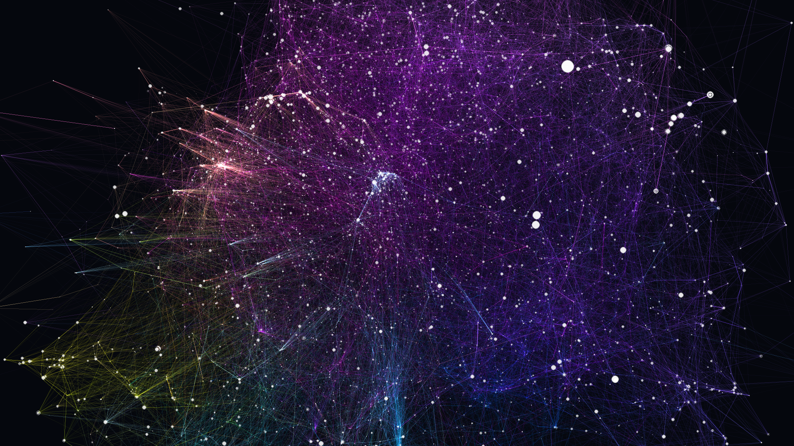
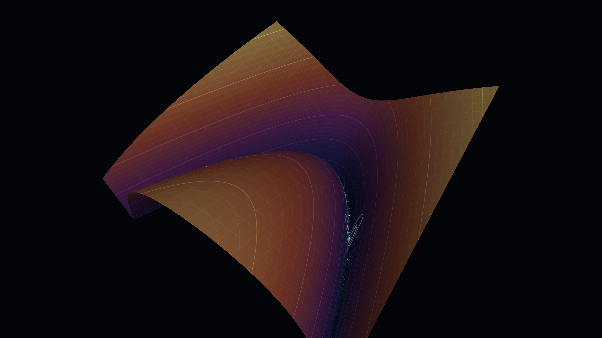
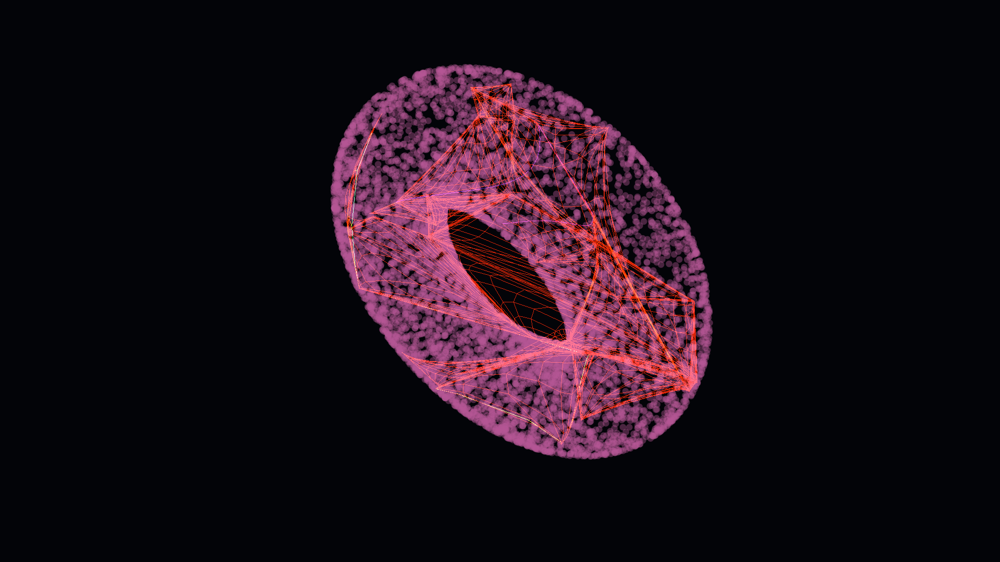
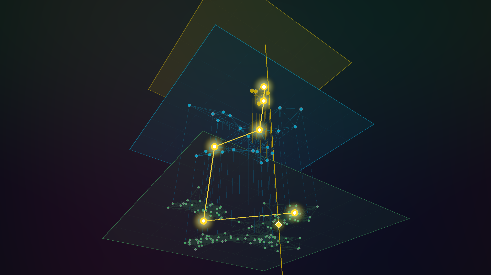
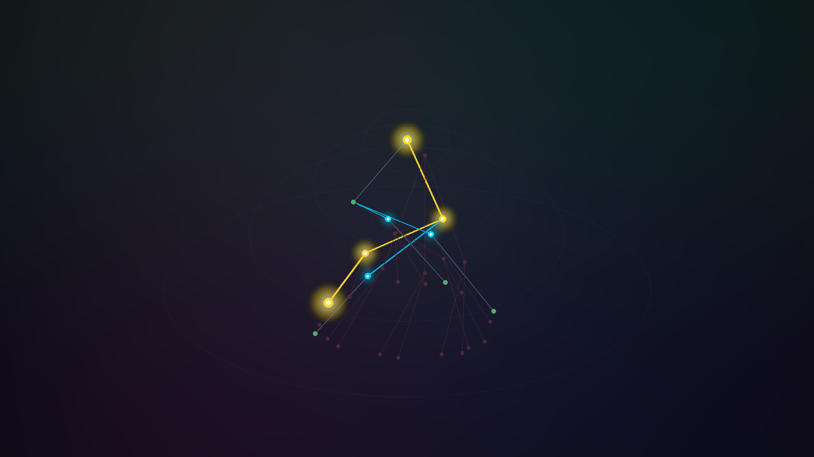
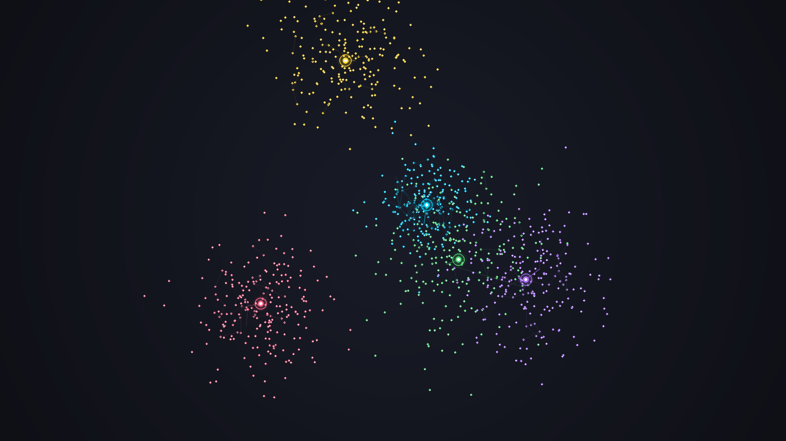
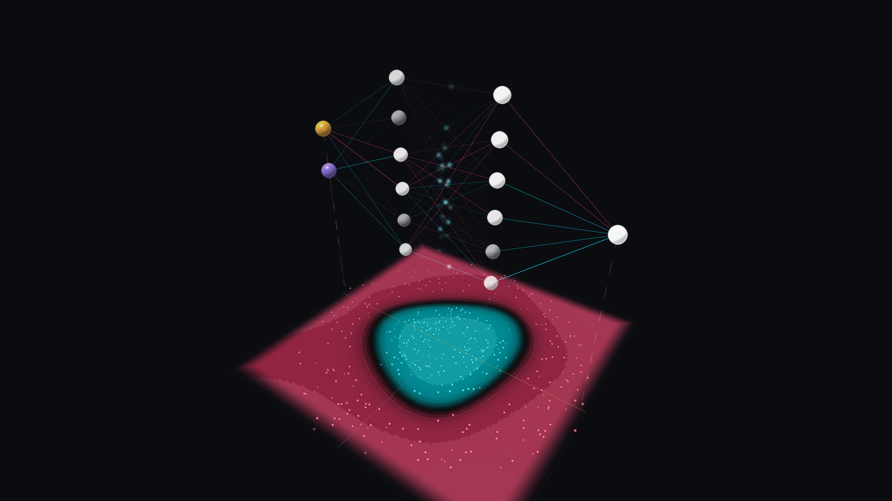
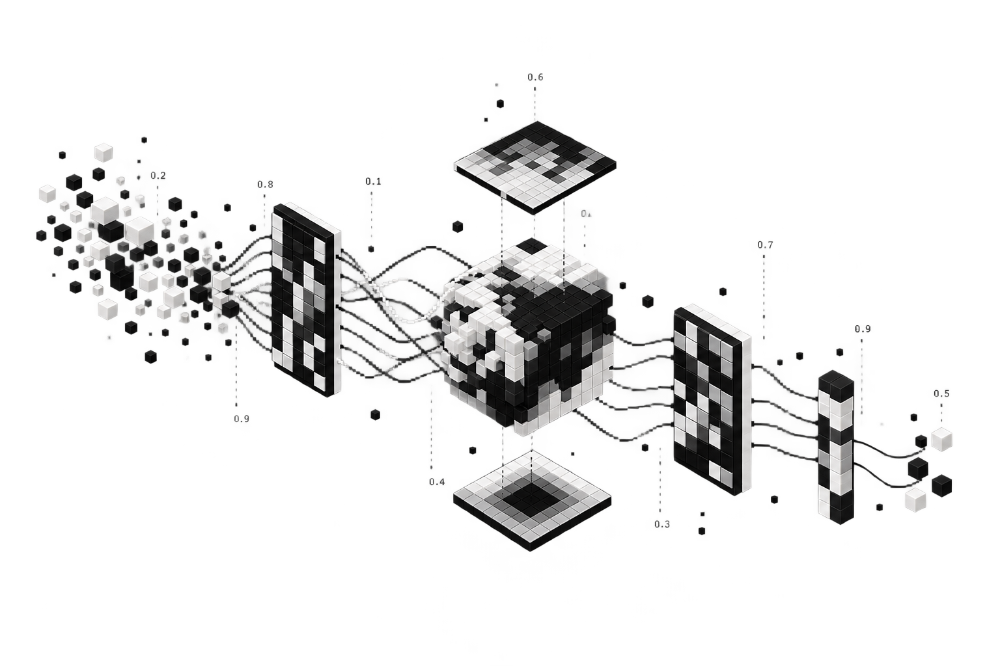

<div align="center">


# TensorMesh
### *The Shape of Artificial Mind*

**A High-Performance WebGPU Laboratory for 3D AI Geometry, Optimization Dynamics & High-Dimensional Vector Spaces**

[](https://tensormesh.vercel.app)
[](https://www.w3.org/TR/webgpu/)
[](https://www.typescriptlang.org/)
[](https://astro.build/)
[](https://numpy.org/)
[**Live Application**](https://tensormesh.vercel.app) &nbsp;•&nbsp; [**3D Galleries**](#interactive-3d-galleries) &nbsp;•&nbsp; [**WebGPU Engine**](#webgpu-engine--hardware-pipeline) &nbsp;•&nbsp; [**Quickstart**](#quickstart--development) &nbsp;•&nbsp; [**Contributing**](CONTRIBUTING.md)

---

</div>

<br/>

## Overview

**TensorMesh** is an open-source, zero-backend, client-side interactive laboratory engineered to explore high-dimensional artificial intelligence representations, non-convex optimization surfaces, neural topologies, and vector retrieval algorithms in real-time 3D.

Unlike traditional machine learning visualizers that depend on pre-rendered videos or static dimensionality reduction (such as t-SNE or UMAP), **TensorMesh computes physics simulations, tensor transformations, and ray-picking directly on your GPU** through custom WGSL compute shaders.

### Architecture Highlights
- **Zero Server & Zero API Cost**: Fully static client deployment. 50,000 nodes and 147,000 edges load from a **1.4 MB Brotli** compressed binary payload.
- **On-Demand 300D Semantic Ground Truth**: While the 3D layout evolves via an N-body spring simulation, every cosine similarity, semantic path, and analogy is calculated against true 300D FastText vectors via **HTTP byte-range requests (300 bytes/word)**.
- **Dual-Engine Architecture**: Automatic hardware capability detection initializes the custom **WebGPU WGSL engine** or falls back to a **WebGL / Three.js** static viewer on legacy hardware.
- **Perceptually Calibrated Color Science**: Continuous cluster coloring in **Oklch** polar space, ensuring uniform perceived luminance and blending continuous semantic boundaries.

---

## Interactive 3D Galleries

| Room | Algorithm / Architecture | Visual Preview | Live Capabilities |
| :--- | :--- | :---: | :--- |
| **01 // Embedding Nebula**<br/>`(/embedding-nebula)` | **50,000-Word FastText N-Body Graph**<br/>• LinLog energy model<br/>• Tile-based negative sampling<br/>• GPU indirect draw culling |  | • Full 3D camera flight and orbit<br/>• Multi-word semantic comparison<br/>• Classical 2D MDS group constellation<br/>• Shortest semantic path navigation |
| **02 // Gradient Descent**<br/>`(/gradient-descent)` | **Non-Convex Optimization Surfaces**<br/>• 40,000 autonomous GPU walkers<br/>• Rosenbrock, Beale, Rastrigin<br/>• SGD vs. Momentum vs. Adam |  | • Real-time vector field streamlines<br/>• Dynamic learning rate and momentum<br/>• Ravine crawling visualization<br/>• Multi-optimizer race mode |
| **03 // Self-Organizing Maps**<br/>`(/self-organizing-maps)` | **3D Kohonen Neural Lattice**<br/>• Dynamic topological sheet fitting<br/>• Gaussian neighborhood kernel<br/>• Lorenz attractor & Torus targets |  | • Real-time mesh folding and stretching<br/>• Live training epochs on GPU<br/>• 6 target geometric topologies<br/>• Interactive elasticity controls |
| **04 // HNSW Vector Search**<br/>`(/hnsw)` | **Hierarchical Navigable Small World**<br/>• Multi-layer skip-graph traversal<br/>• Logarithmic neighbor retrieval<br/>• Vector database foundation |  | • Layer-by-layer greedy exploration<br/>• Entry-point jump visualization<br/>• Beam search candidate set tuning<br/>• Distance metric diagnostics |
| **05 // MCTS Reasoning Trees**<br/>`(/mcts)` | **Tree-of-Thoughts & Reasoning Search**<br/>• Monte Carlo Tree Search in 3D<br/>• UCB1 exploration-exploitation<br/>• Inference-time compute (o1/R1) |  | • Real-time hypothesis expansion<br/>• Reward backpropagation pulse<br/>• Subtree pruning & proof verification<br/>• Interactive branching factor control |
| **06 // K-Means Clustering**<br/>`(/kmeans)` | **Expectation-Maximization & Voronoi**<br/>• 3D Voronoi partition bounds<br/>• Centroid inertia minimization<br/>• Lloyd's algorithm convergence |  | • Step-by-step EM iteration<br/>• Centroid convergence tracking<br/>• Dynamic K cluster adjustment<br/>• Multi-modal point cloud presets |
| **07 // Neural Network**<br/>`(/neural-network)` | **Multilayer Perceptron & Backprop**<br/>• Live SGD on 5 classic datasets<br/>• ReLU / Tanh / Sigmoid<br/>• Editable depth and width |  | • Decision boundary redrawn 5×/s<br/>• Forward and backward signal pulses<br/>• Click a neuron to see its own field<br/>• Train vs. test loss, dead-unit counter |

---

## WebGPU Engine & Hardware Pipeline

The physics simulation runs inside a compute shader where vertex coordinates **never leave VRAM**. The storage buffer written by the LinLog compute shader is bound directly into vertex draw calls, eliminating CPU-GPU memory roundtrips.

```
┌─────────────────────────────────────────────────────────────────────────────┐
│                             GPU PIPELINE (VRAM)                             │
│                                                                             │
│  ┌───────────────────────┐             ┌─────────────────────────────────┐  │
│  │   Physics Compute     │ ──Write──>  │ Positions Buffer (Int16 / F32)  │  │
│  │ (LinLog + Tile Neg)   │             └─────────────────────────────────┘  │
│  └───────────────────────┘                              │                   │
│             ▲                                        Read as SSBO           │
│             │                                           │                   │
│  ┌───────────────────────┐                              ▼                   │
│  │  Frustum & Screen-Len │ ──Write──>  ┌─────────────────────────────────┐  │
│  │  Indirect Culling     │             │ Indirect Draw Arguments Buffer  │  │
│  └───────────────────────┘             └─────────────────────────────────┘  │
│                                                         │                   │
│                                                         ▼                   │
│                                        ┌─────────────────────────────────┐  │
│                                        │ Render Pipeline (Rasterization) │  │
│                                        │ • Anti-aliased disc nodes       │  │
│                                        │ • Additive mesh thin lines      │  │
│                                        │ • Oklch continuous hue blending │  │
│                                        └─────────────────────────────────┘  │
└─────────────────────────────────────────────────────────────────────────────┘
```

### Performance Benchmarks (AMD Vega 6 Integrated GPU @ 1280×720, 50,000 nodes)

Recorded with **GPU hardware timestamps** (median over 64 continuous frames):

| Rendering Pass | Execution Time (ms) | Performance Impact |
| :--- | :---: | :--- |
| **GPU Frustum & Length Culling** (2 compute dispatches) | `0.26 ms` | Compacts visible geometry into indirect buffers |
| **Geometry Draw (Standard, unculled)** | `13.30 ms` | Baseline full-mesh rasterization |
| **Geometry Draw (With GPU indirect culling)** | `10.49 ms` | **+21.1% faster** (culls 44% edges full-view, 68% zoomed) |
| **Geometry Draw (Culling + 40% adaptive mesh thinning)** | **`5.05 ms`** | **+62.0% faster** (preserves total nebular luminosity) |
| **Physics Simulation (Global sampling)** | `2.29 ms` | K random incoherent memory fetches per node |
| **Physics Simulation (Shared-Memory Tile Sampling)** | **`1.05 ms`** | **Flat latency curve from K=8 to K=32** |
| **Total Full-View Frame Time** | **`6.36 ms`** | **Solid 60 FPS on low-power integrated graphics** |

---

## Core Optimization Techniques

### 1. Indirect GPU Culling (`cull.wgsl`)
Two compact compute passes evaluate node frustum visibility and projected edge pixel length. Sub-pixel edges in dense clusters are discarded on the GPU, writing draw arguments directly to an indirect draw buffer without CPU synchronization.

### 2. Additive Mesh Thinning with Luminosity Compensation
Rasterization overhead scales with **total rendered pixel length**, not raw edge count. TensorMesh decimates the background edge mesh using a deterministic hash per edge while boosting remaining line luminance by `1 / keep_ratio`. The visual nebula retains consistent perceived light density across any level of detail.

### 3. Shared-Memory Tile Negative Repulsion
Fetching $K$ random coordinates per thread generates heavy cache line misses. Each 64-thread workgroup cooperatively loads 64 positions into WGSL `var<workgroup>` shared memory once. Threads sample locally, rendering the execution time flat at **1.05 ms** regardless of sample count $K$.

### 4. TCP AIMD Framerate Budget Controller
Under 60 Hz vsync constraints, frame times oscillate between 16.7 ms and 33.3 ms when quality overshoots. An Additive Increase / Multiplicative Decrease (AIMD) feedback controller establishes an empirical headroom threshold, eliminating frame hunting and stuttering.

### 5. Atomic Ray-Picking via `atomicMin` (`pick.wgsl`)
Word selection queries pack mouse ray distance and node indices into a single `u32`. A single compute dispatch executes in $O(N)$ without requiring KD-tree rebuilds as particles move during live physics.

---

## Data Pipeline & Compressed Sparse Formats

The preprocessing pipeline converts raw vectors (`.vec`) into custom contiguous binary Compressed Sparse Row (CSR) structures designed for zero-copy memory mapping without runtime parsing.

<div align="center">

</div>

### Binary Footprint (50,000 Words)

| Binary File | Data Layout | Size (Disk) | Network (Brotli) |
| :--- | :--- | :---: | :---: |
| `positions.bin` | `Int16 × 3` packed fixed-point coordinates + scale | `293 KB` | ~190 KB |
| `edges.bin` | CSR Layout (`offsets: Uint32`, `targets: Uint16`, `weights: Uint8`) | `1,058 KB` | ~710 KB |
| `labels.bin` | String byte offsets (`Uint32`) + UTF-8 byte stream | `591 KB` | ~380 KB |
| `attrs.bin` | `community: Uint8`, `rank: Uint16`, `flags: Uint8` | `195 KB` | ~146 KB |
| **Total Base Atlas** | **Complete navigable 3D galaxy** | **`2,138 KB`** | **`1,426 KB`** |
| `vecs.bin` | $300 \times \text{int8}$ quantized vector per word (On-demand) | `14.6 MB` | **`300 B / query`** |

> [!NOTE]
> **On-Demand Vector Access (`vecs.bin`)**: The 15 MB vector file is never downloaded upfront. When evaluating semantic analogies or comparisons, the client issues an HTTP Range request (`Range: bytes=i*300-(i*300+299)`) to retrieve only the 300 bytes required for that specific entry.

---

## Perceptual Color Science & UI Architecture

```
                          Oklch Perceptual Nebula Ramp
  Cyan ───► Electric Blue ───► Violet ───► Magenta ───► Rose ───► Amber ───► Yellow ───► Emerald
 (0.15 C)       (0.19 C)       (0.24 C)    (0.31 C)    (0.26 C)   (0.20 C)   (0.18 C)    (0.17 C)
```

- **Perceptual Oklch Color Uniformity**: Color represents semantic neighborhood rather than arbitrary labels. Cluster centroids are ordered along the primary planar projection. Neighboring communities transition smoothly without perceptual luminance dips.
- **Maximized Gamut Boundary**: Chroma is fitted to the exact sRGB boundary via bisection search, delivering vibrant neon tones without clipping.
- **Anti-Aliased Disc Geometry**: Nodes are drawn as flat discs with `fwidth()` shader smoothing, depth testing, and alpha blending, preventing saturation into opaque white clusters.
- **Kinetic Flight Navigation**: Hybrid input architecture (`galaxy/keys.ts`) provides damped momentum physics for both mouse orbiting and `WASD` / `QE` 6-DOF camera flight.

---

## Quickstart & Development

### Prerequisites
- **Node.js**: v18.0.0 or higher
- **Python**: 3.10+ (Python 3.14 compatible, requires only `numpy`, `scipy`, and `pillow`)

### 1. Web Application

```bash
# Clone the repository
git clone https://github.com/Jhongdlp/TensorMesh.git
cd TensorMesh/web

# Install dependencies
npm install

# Launch development server
npm run dev

# Run test suite (Types, Pure Logic, GPU Physics & WebGPU Shaders via Dawn)
npm test
```

### 2. Python Pipeline (Optional / Headless Generation)

```bash
# Generate both Spanish & English datasets from scratch
./pipeline/all.sh es en

# Or execute individual pipeline stages:
python3 pipeline/fetch.py es 100000       # Stage 00: Fetch FastText embeddings
python3 pipeline/build.py es 50000 1200   # Stages 01-07: kNN, MST backbone, LinLog layout
python3 pipeline/vectors.py es            # Stage 08: Quantize 300D vectors to int8
python3 pipeline/validate.py es           # Validate semantic analogies & clustering
```

---

## Automated Verification Suite

The repository includes a headless verification suite testing WGSL compute shaders against NumPy reference fixtures without requiring a browser:

```bash
cd web

# 1. Unit Tests (< 1 second, CPU logic)
node test/unit.mjs es

# 2. WebGPU Compute Shader Physics (Headless Dawn vs. NumPy)
npm run test:physics

# 3. WebGPU Offscreen Render & Selection Verification
npm run test:render
```

---

## Mathematical Foundations

1. **LinLog Energy Model**:
   $$E = \sum_{(u,v) \in E} w_{uv} \|p_u - p_v\| - \sum_{u,v \in V} \text{deg}(u)\text{deg}(v) \ln \|p_u - p_v\|$$

2. **Classical Multidimensional Scaling (MDS)** on Normalized Vectors:
   $$d_{ij}^2 = \|u_i - u_j\|^2 = 2 - 2 \cos(\theta_{ij})$$

3. **Stress Metric**:
   $$\sigma = \frac{\sum_{i < j} (d_{ij} - \hat{d}_{ij})^2}{\sum_{i < j} d_{ij}^2}$$

---

## 🤝 Contributing & Community Public Gallery

TensorMesh is an open-source public gallery and visual AI laboratory. We are actively inviting developers, researchers, and creative coders to build and submit their own **WebGPU algorithms & visual courses**.

- **English Guide**: Read the [**CONTRIBUTING.md**](CONTRIBUTING.md) for architecture templates, WGSL shader boilerplates, and step-by-step instructions.
- **Guía en Español**: Consulta [**CONTRIBUTING_ES.md**](CONTRIBUTING_ES.md) para la guía completa en español.
- **Online Hub**: Explore our live [**Collaborate / Colaborar**](https://tensormesh.vercel.app/colaborar) page.

### Desired Community Algorithms (Wishlist)
- **3D Transformers & Attention Maps** ($Q, K, V$ softmax routing in 3D).
- **Diffusion Models & Latent Denoising** (Iterative reverse diffusion on GPU).
- **Neural Cellular Automata (NCA)** (Pattern growth & morphogenesis).
- **Barnes-Hut N-Body Gravity** (Spatial octree partitioning in compute shaders).
- **Real-Time t-SNE / UMAP** (High-dimensional manifold unfolding on GPU).
- **Quantum Circuit Simulator** (Bloch spheres & state entanglement).

---

## Author & Attribution

Developed by **Jhonatan (Jhongdlp)**:

[](https://jhongdlp.com)
[](https://github.com/Jhongdlp)
[](https://x.com/jhongdlp)
[](https://instagram.com/jhongdlp.dev)

### Citations & Attribution
- Word vector embeddings sourced from [Facebook Research fastText](https://fasttext.cc/docs/en/crawl-vectors.html) (Licensed under **CC BY-SA 3.0**).
- Graph layout references and baseline inspiration: `anvaka/pm`.

---

<div align="center">

<sub>TensorMesh — Real-Time High-Dimensional AI Geometry and WebGPU Laboratory.</sub>

</div>
